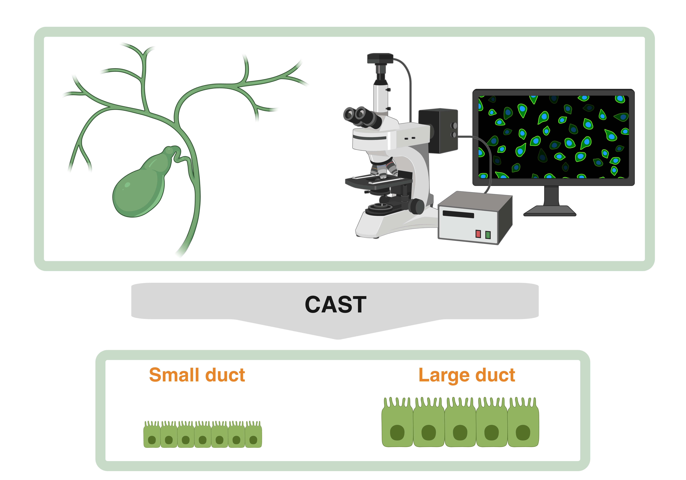

# CAST-CholAngiocarcinoma-SubTyping
A deep learning model for automated histological subtyping of intrahepatic cholangiocarcinoma.

## What is this?
This is the source code for a deep learning model for histological classification of intrahepatic cholangiocarcinoma into small and large duct subtypes, currently under review at a scientific journal.

## Introduction
Emerging evidence substantiated that there are two main histological phenotypes of intrahepatic cholangiocarcinoma: a small duct and a large duct phenotype. These subtypes come along with etiologic, predictive and prognostic implications; however, correct classification requires distinct expertise in hepatobiliary pathology. We here present an artifical intelligence-based model for universal and rapid classification of intrahepatic cholangiocarcinoma, based on thoroughly characterized internal and external cohorts.

## Model architecture
We used our established EfficientNET B3 pipeline (see [HEPNET](https://github.com/ThsAlb/HEPNET-Hepatic-adenocarcinoma-classification/tree/main/scripts)). Training occured in a cross-validation manner with weights precalibrated to ImageNet. After transfer learning with frozen base, we finetuned every layer according to our dataset.

## How to use
The final model, including its weights, can be downloaded in the folder /model. It can be applied to any image tile with 300 x 300 pixel entry dimensions. We recommend QuPath for image partitioning and prior color normalization (via the Macenko method). The model will output a probability of the tile to represent small duct or large duct subtype (sigmoid function).

## Dependencies
Linux (Tested on Ubuntu 18.04)
NVIDIA GPU (Tested on Nvidia GeForce RTX 3090)
Python (3.6), TensorFlow (version 2.6.0), Keras (version 2.6.0), Numpy (version 1.19.5), Pandas (version 1.1.5), OpenCV (version 4.5.1.48), Pillow (version 8.1.2), SciPy (version 1.5.4), scikit-learn (version 0.24.1), matplotlib (3.3.4), scikit-image (version 0.17.2) and scikit-plot (version 0.3.7).

## License
This code is made available under the MIT License and is available for non-commercial academic purposes.
